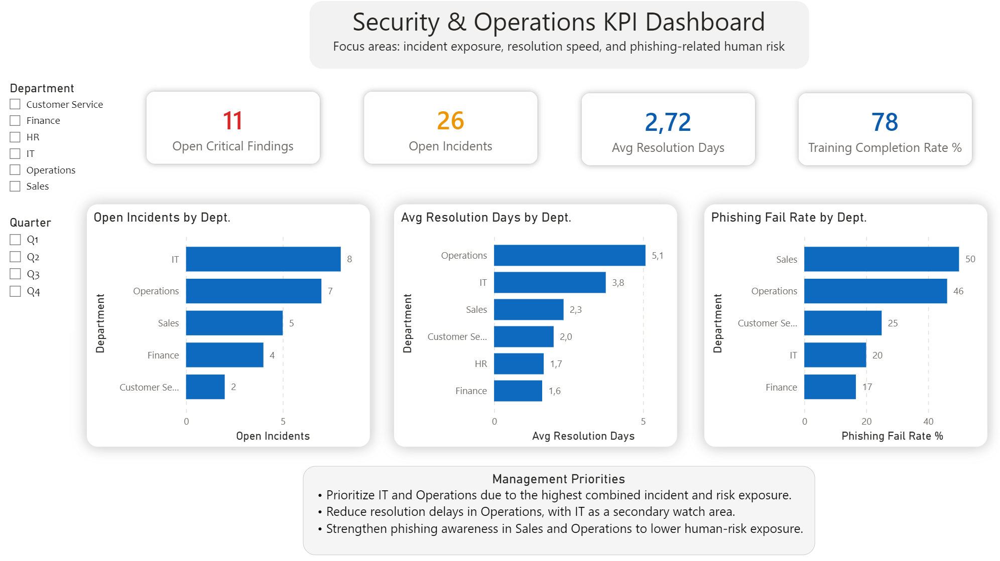
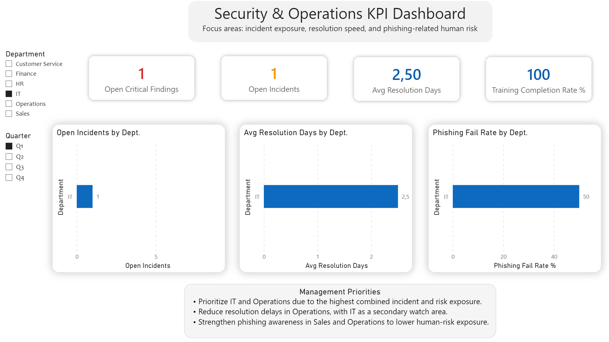

# security-operations-kpi-dashboard
Eigenprojekt zur Analyse von Security- und Operations-KPIs mit SQL, SQLite und Power BI.

## Ziel

Ziel des Projekts war es, relevante Security- und Operations-Daten für ein Management-Reporting aufzubereiten und in einem interaktiven Dashboard verständlich darzustellen. Im Mittelpunkt standen Risiken, Incident-Belastung, Lösungszeiten und Awareness-Kennzahlen auf Abteilungsebene.

## Verwendete Tools

- SQLite
- Beekeeper Studio
- SQL
- Power BI

## Datengrundlage

Die verwendeten Daten sind synthetisch erstellt und dienen ausschließlich Demonstrationszwecken.

Analysiert wurden strukturierte Daten zu:

- Incidents
- Critical Findings
- Phishing-Kampagnen und Trainingsquoten
- Abteilungen

Die Quelldateien befinden sich im Ordner [`data`](data).

## Vorgehen

- Übertragung und Strukturierung der Daten in einer SQLite-Datenbank
- Analyse der Daten mit SQL-Abfragen
- Berechnung relevanter Security- und Operations-KPIs
- Visualisierung der Ergebnisse in Power BI
- Ableitung von Management-Prioritäten auf Basis der Analyse

## Analysierte Kennzahlen

- Offene Incidents
- Offene kritische Findings
- Durchschnittliche Lösungsdauer nach Department
- Phishing Fail Rate nach Department
- Trainingsquote und Awareness-Risiken
- Vergleich von Risiko- und Operations-Belastung nach Department und Quarter

## Zentrale Erkenntnisse

- IT und Operations zeigen die höchste kombinierte Belastung aus Vorfällen und Risikoexposition.
- Operations weist die höchste durchschnittliche Lösungsdauer auf.
- Sales und Operations zeigen die höchsten Werte bei der Phishing Fail Rate.
- Daraus ergeben sich Prioritäten für schnellere Incident-Bearbeitung und gezielte Awareness-Maßnahmen.

## Dashboard

### Übersicht

### Beispiel: Filteransicht für Q1 und IT

## Projektdateien

- [`data`](data) – synthetische Quelldaten als CSV-Dateien
- [`dashboard`](dashboard) – Screenshots des Power-BI-Dashboards
- [`sql/security_kpi_queries.sql`](sql/security_kpi_queries.sql) – SQL queries, die für die KPI Analyse genutzt wurden

## Hinweis

Dieses Projekt wurde als Eigenprojekt erstellt, um praktische Kenntnisse in SQL, relationaler Datenanalyse, KPI-Reporting und Power-BI-Visualisierung anzuwenden.
